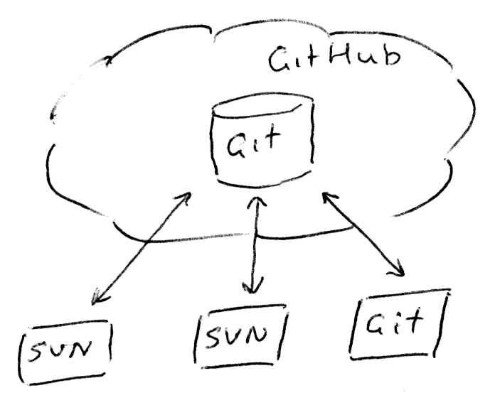
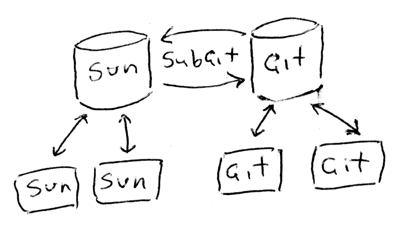

[[about]]
= About project

== What is it?

git-as-svn (https://github.com/bozaro/git-as-svn) —
Subversion-server implementation (svn protocol) for Git-repositories.

This project allows to work with Git-repository using Subversion console
client, TortoiseSVN, SvnKit and other similar tools.

== What is project goal?

The project is designed to allow you to work with the same repository as
Git, Subversion and style.

Git style::
  The basic idea is that the developer works in the local branch. His
  changes do not affect the work of other developers, but nonetheless
  they can be tested on CI farm, review by another developer and etc.
  +
  This allows each developer to work independently, as best he can. He
  can change and saving intermediate versions of documents, taking full
  advantage of the version control system (including access to the
  change history) even without network connection to the server.
  +
  Unfortunately, this approach does not work with not mergeable
  documents (for example, binary files).
Subversion style::
  The use of a centralized version control system is more convenient in
  the case of documents do not support the merge (for example, with
  binary files) due to the presence of the locking mechanism and a
  simpler and shorter publication cycle changes.

The need to combine Git and Subversion style work with one repository
arises from the fact that different employees in the same project are
working from fundamentally different data. If you overdo, you Git
programmers, and artists like Subversion.

== Why do we need it?

This project was born out of division teams working on another project into two camps:

 * People who have tasted the Git and do not want to use Subversion (eg programmers);
 * People who do not get from Git practical use and do not want to work with him, but love Subversion (eg designers).

To divide the project into two repository desire was not for various reasons.

At this point, saw the project http://git.q42.co.uk/git_svn_server.git with Proof-of-concept implementation svn server
for git repository. After this realization svn server on top of git and didn't seem completely crazy idea (now it's
just a crazy idea) and started this project.

== How does it work?

image:images/git-as-svn.png[image]

=== Where is the Subversion data stored?

To represent Subversion repository need to store information about how
Subversion-revision number corresponds to which Git-commit. We can't
compute this information every time on startup, because first
`git push --force` change revision order. This information stored
persistent in git reference `refs/git-as-svn/*`. In particular because
it does not require a separate backup Subversion data. Because of this
separate backup Subversion data is not necessary.

Also part of the data necessary for the Subversion repository, is very
expensive to get based on Git repository.

For example:

* the revision number with the previous change file;
* information about where the file was copied;
* MD5 file hash.

In order not to find out their every startup, the data is cached in
files. The loss of the cache is not critical for the operation and
backup does not make sense.

File locking information currently stored in the cache file.

=== How does commit works?

One of the most important parts of the system — to save the changes.

In general, the following algorithm:

1.  At the moment the command `svn commit` client sends to the server of
your changes. The server remembers them. At this point comes the first
check the relevance of customer data.
2.  The server takes the branch HEAD and begins to create new commit on
the basis of client received delta. At this moment there is yet another
check of the relevance of customer data.
3.  Validating svn properties for changed data.
4.  The server tries to push the new commit in the current branch of the
same repository via console Git client. Next, the result of a push:
* if commits pushed successfully — loading the latest changes from git
commits and rejoice;
* if push is not fast forward — load the latest changes from git commits
and go to step 2;
* if push declined by hooks — inform the client;
* on another error — inform the client;

Thus, through the use console Git client for push, we avoid the race
condition pouring directly change Git repository, and get the native
hooks as a nice bonus.

=== Unlike other solutions

The problem of combining Git and Subversion work style with a version
control system can be solved in different ways.

==== GitHub Subversion support

This is probably the closest analogue.

The main problem of this implementation is inseparable from GitHub.
Also, all of a sudden, this implementation does not support Git LFS.

In the case of GitHub it is also not clear where the stored mapping
between Subversion-revision and Git-commit. This can be a problem when
restoring repositories after emergency situations.

==== SubGit

Web site: http://www.subgit.com/

Quite an interesting implementation which supports master-master
replication with Git and Subversion repositories. Thereby providing
synchronization of repositories is not clear.

==== Subversion repository and git svn

image:images/git-svn.png[image]

This method allows you to use Git with Subversion repository, but using
a shared Git repository between multiple developers very difficult.

At the same time, the developer has to use a specific command-line tool
for working with the repository.

== Features

This implementation allows the majority of Subversion-users to work
without thinking about what they actually use Git-repository.

=== What is already there?

* You can use at least the following clients:
** Subversion console client
** TortoiseSVN
** SvnKit
* Supported subversion operations:
** svn checkout, update, switch, diff
** svn commit
** svn copy, move footnote:[Operations are supported, but the data about the
source of a copy is not saved. Information about the source copy is calculated
on Git-repository commits.]
** svn cat, ls
** svn lock, unlock
** svn replay (svnsync)
* Git LFS support
* Git submodules supported footnote:[Git submodule data available in readonly mode.]
* LDAP authorization
* GitLab integration
* Gitea integration

=== What is lacking?

* Large gaps in the documents;
* You can only access one branch from Subversion.

=== Technical limitations

* It is impossible to change svn properties by Subversion client;
* Empty directories is not allowed.
